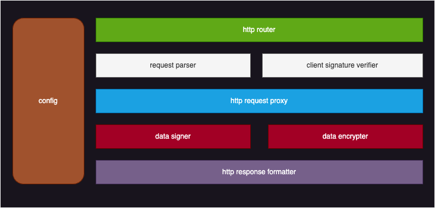

# Orange Provider Wrapper

## 1. Introduction
本工具为了解决Orange 对接外部数据源（DP）或算法（AP）时，涉及到的不同的input / output schema 的对齐，访问权限考验和数据的签名及加密问题。

## 2. System Design


### 2.1 http router:
提供标准的http服务路径， 可以在config文件中配置，为POST请求

### 2.2 request parser
标准的request应该包含orange 系统的did签名

```
{
    "request":{
        "requester_did":did:etho:xxxx / did:ont:xxxxx
        "request_data":{...},
        "encrypt":true  // encrypt response data or not
        },
    "sig":0xabcdefghijklmnopqrstuvwxyz
}
```


### 2.3 client signature verifier
1. orange 系统的did配置在config文件中
2. 从链上合约查询did对应pubkey
3. 验证 orange did的签名


### 2.4 http request proxy
根据config中的配置
1. 设置apikey : 若有
2. 构造请求参数: (POST / GET)
3. 处理返回的数据和错误消息
   
### 2.5 data signer
从config文件中读取钱包文件
对返回的数据进行签名


### 2.6 data encrypter
如果request中的encrypt = true时，从对应的合约中读取requester的pubkey,将返回数据使用该pubkey进行加密

### 2.7 http response formatter
合并所有的数据，返回给请求端

### 2.8 config

```

{
    "orange_did":"",
    "wallet_file":"",
    "chain_rpc":"",
    "contract_address":"",
    "apis":[
        {
            "server_path":"",
            "has_api_key":true,
            "api_key_location":"",
            "api_key_name":"",
            "api_key":"",
            "api_url":"",
            "api_method":"GET"
        }
    ]

}

```

## 3. tools
### 3.1 判断当前的节点是否已经注册公钥
若未注册则提示注册并退出


### 3.2 生成新的钱包

```
./orange-provider-wrapper createWallet
```
钱包文件将创建在config.json的指定的目录下，并使用指定的密码

提供注册的方法
```
./orange-provider-wrapper registerPubkey 
```

### 3.2 取得orange系统的did

### 3.3 启动http的路由监听