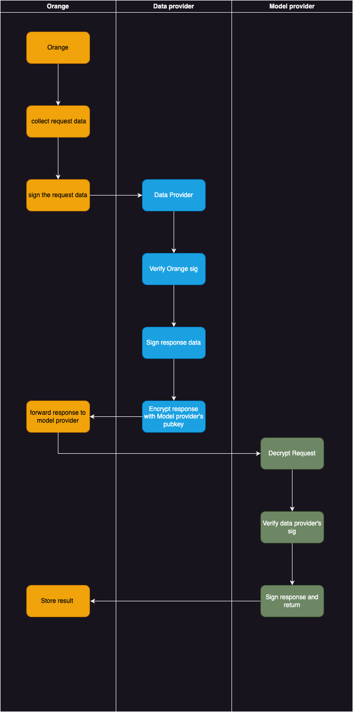

# Orange Provider data Protocol

## 1. Introduction
Orange Provider data Protocol (PDP) is a set of rules and specifications that define how data providers can exchange data with Orange. It defines the data format, content, and security measures that Orange should follow when exchanging data with data providers.

## 2. Data Flow




## 3. Data format

### 3.1 Orange Data Provider Request
```json
{
    "request":{
        "requester_did":"", //model provider did
        "request_data":"",  //request data to invoke model method
        "encrypt":true      //wether encrypt resonse data or not,default true
    },
    "sig":"0x1234567890123456789"   //signature of request section
}

```

### 3.2 Orange Data Provider Response (same to Model Provider Request)

```json
{
    "data":{
        "data":"", //data returned by model provider
        "provider_did":"", //data provider(self) did
        "sig":"0x1234567890123456789" //signature of response data
    },
    "encrypted":"" //encrypted response data
}
```
***NOTE***: "data" and "encrypted" are mutually exclusive, only one of them will be present in response.

### 3.3 Orange Model Provider Response 
```json
{
    "data":"", //data returned by model provider
    "provider_did":"", //model provider(self) did
    "sig":"0x1234567890123456789" //signature of response data
}
```
## 4. Orange Proxy Provider Wrapper
A golang implementation 
[orange-provider-wrapper](https://github.com/orange-protocol/orange-provider-wrapper)

***NOTE*** : golang marshal & unmarshal json data may different with other language (such as Java), this may cause verify signature failed.