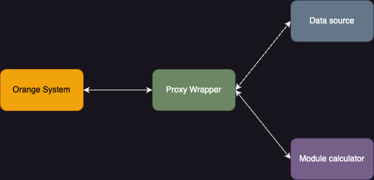
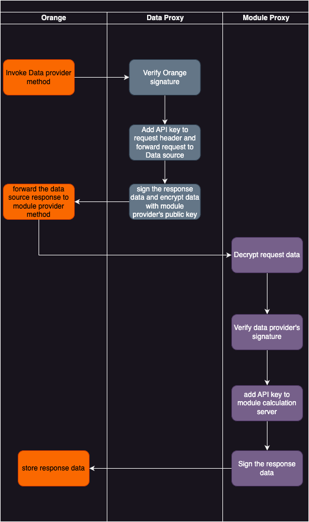
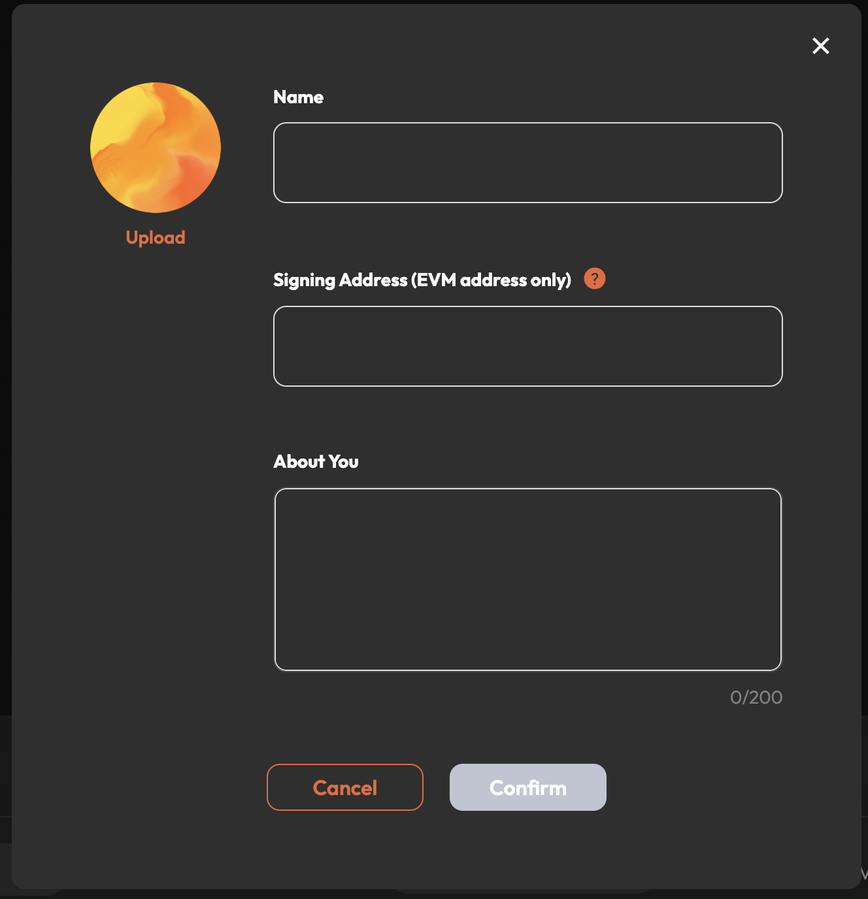
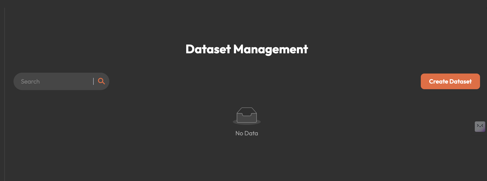
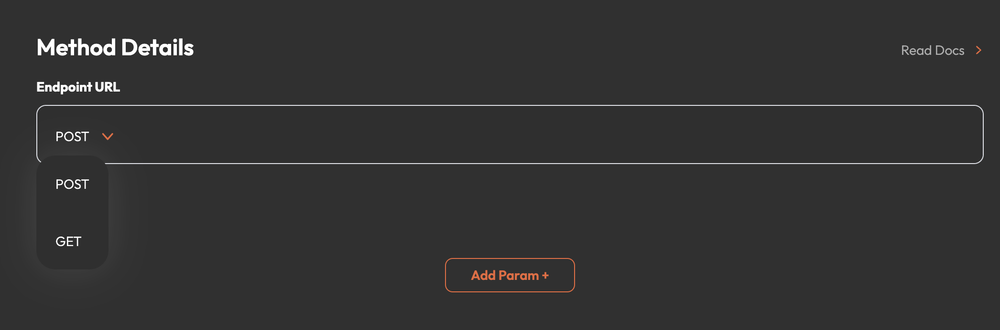
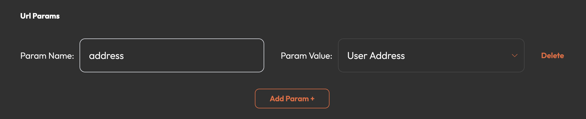
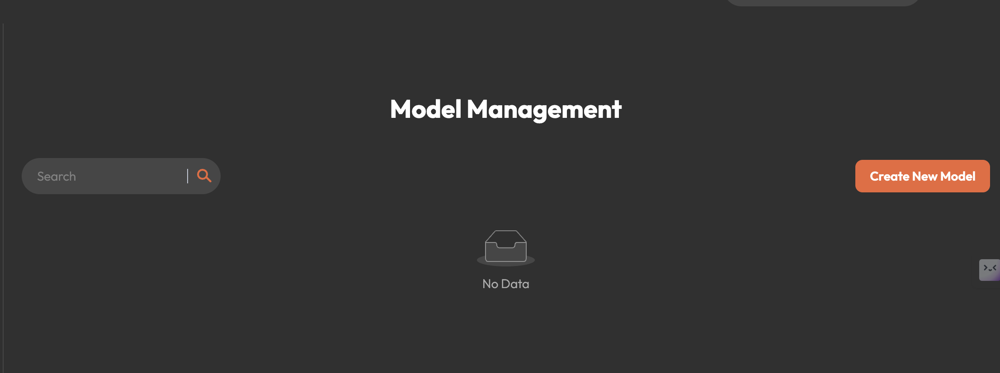
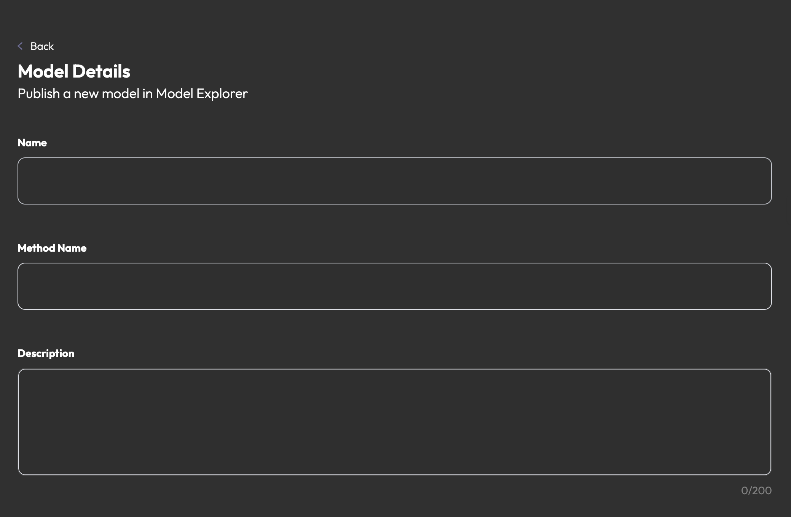
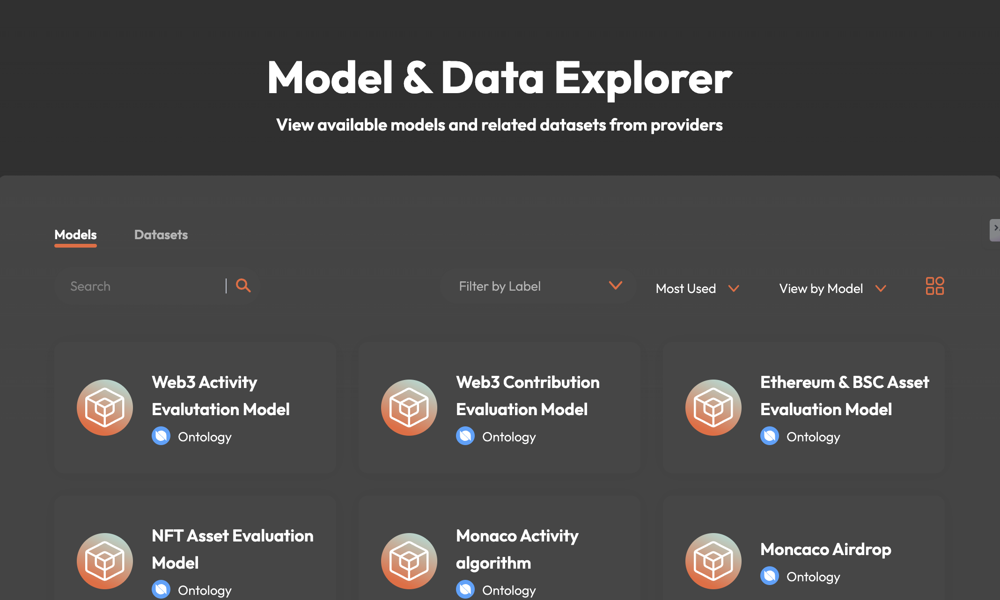

# How to start

## 1. Background

To make it easier for developers to start at Orange Protocol, a proxy template is provided, with wrapper data & module interface in Orange system. Thus, every developer can get started quickly as a Proxy Provider.

## 2. Proxy Provider Introduction


Proxy wrapper helps provide a unified interface for different providers, hiding API keys, embedding request data signature verification and decryption, response data signing and encryption.



## 3. How to be an Orange proxy provider
If you want to be an Orange proxy provider, you need to follow these steps:
1. Register the provider in Orange system.
   
2. Fill in the provider information in Orange system.
   
   **Note**: the "Signing Address" is used to sign the response message and decrypt the response message as a module provider.

3. The register information will be reviewed by Orange system. If approved, the provider will be activated.

### 3.1 Orange proxy wrapper
1. Get Orange proxy wrapper project from [Github](https://github.com/orange-protocol/orange-provider-wrapper)
```
git clone https://github.com/orange-protocol/orange-provider-wrapper.git

cd orange-provider-wrapper 

go build
```

Generally, you don't need to modify the code of the proxy wrapper, but you can customize the provider information if you need to connect to the api which requests formats that are not supported by the provider wrapper.

2. Edit the config.json file

A sample config.json looks like below:
```json
{
    "orange_did":"did:etho:1ae43df6f4c5621e2b156162e958c80a67ee4f5f",
    "keystore":"./keystore",
    "wallet_pwd":"123456",
    "chain_id":5851,
    "chain_rpc":"http://polaris1.ont.io:20339", //"http://dappnode1.ont.io:20339" for mainnet
    "contract_address":"0x18d3dB10B18369691c86e7EF99cBd9B290BaD87A", //"0x4944C094ea58a1E456AD720f5baD4AfCEB619863" for mainnet
    "api_configs":[
        {
            "provider_type":"dp",
            "verify_request":true,
            "server_path":"/balance1",
            "has_api_key":true,
            "api_key_location":"header",
            "api_key_name":"x-api-key",
            "api_key":"test",
            "api_url":"http://localhost:8088/sampleGetUrlDP",
            "api_method":"GET",
            "param_type":"url",
            "failed_keywords":[]
        },
        {
            "provider_type":"dp",
            "verify_request":false,
            "server_path":"/balance2",
            "has_api_key":true,
            "api_key_location":"header",
            "api_key_name":"x-api-key",
            "api_key":"test",
            "api_url":"http://localhost:8088/sampleGetBodyDP",
            "api_method":"POST",
            "param_type":"body",
            "failed_keywords":[]
        },{
            "provider_type":"ap",
            "verify_request":true,
            "server_path":"/score",
            "has_api_key":true,
            "api_key_location":"header",
            "api_key_name":"x-api-key",
            "api_key":"test",
            "api_url":"http://localhost:8088/sampleAP",
            "api_method":"POST",
            "param_type":"body",
            "failed_keywords":[]
        }
    ]
}
```

- orange_did: the DID of the provider in Orange system, which will be published on Orange website.
- keystore: the keystore directory of the provider, which contains the private key of the provider.
- wallet_pwd: the password for the wallet stored in the keystore directory.
- chain_id: the chain id of orange contract deployed.
- chain_rpc: chain rpc. ```http://dappnode1.ont.io:20339``` for ONT mainnet.
- contract_address: orange contract address on mainnet ```0x4944C094ea58a1E456AD720f5baD4AfCEB619863```.
- api_configs: the api configuration of the provider.
- - provider_type: "ap" for module provider, "dp" for data provider.
- - verify_request: whether to verify the request message signature.
- - server_path: the server path of the wrapper service.
- - has_api_key: whether the api requires api key.
- - api_key_location: the location of the api key. The only supported value is "header" for now. 
- - api_key_name: the name of the api key.
- - api_key: the value of the api key.
- - api_url: the api url.
- - api_method: the api method, "GET" or "POST".
- - param_type: the type of the api parameter, "url" , "body" and "rest" .
    ```
    for rest api, sometimes you need to add some query parameters to the api url, for example:
    https://deep-index.moralis.io/api/v2.2/wallets/:address/net-worth?exclude_spam=true&exclude_unverified_contracts=true

    in this case, the api_url should be:
    https://deep-index.moralis.io/api/v2.2/$PARAM/net-worth?exclude_spam=true&exclude_unverified_contracts=true
    and the param_type should be "rest".

    in Orange system Dataset management, you should set the param name to "wallets", the wrapper will replace the $PARAM with the "wallets/<actual user address>".
    ```
- - failed_keywords: the keywords of the response message which will cause the request to fail.

### 3.2 Create sign wallet and register did
1. Create wallet
run the following command in your terminal   
```
./orange-provider-wrapper --operation new-wallet

```
the standard ethereum wallet file will be generated in the keystore directory with the password you set in config.json.

2. Register did
run the following command in your terminal   
```
./orange-provider-wrapper --operation register-did

```
***NOTE***: You need to transfer some gas to the wallet address you just created .

### 3.3 Proxy data provider
If you want to be a data provider, you just need to :
1. Get a data source api.
For example:
```
http://sampleDataSourceApi/sampleGetUrlDP?address=0x123456

```
with apikey :```x-api-key:test``` in request header

add "api_configs" section in config.json:
```
    {
        "provider_type":"dp",
        "verify_request":true,
        "server_path":"/balance1",
        "has_api_key":true,
        "api_key_location":"header",
        "api_key_name":"x-api-key",
        "api_key":"test",
        "api_url":"http://sampleDataSourceApi/sampleGetUrlDP",
        "api_method":"GET",
        "param_type":"url",
        "failed_keywords":[]
    }
```
The proxy wrapper will listen to the GET /balance1 path and forward requests to data source api with api key 

2. Create dataset in Orange


Fill in the dataset information


chose "GET" and input the wrapper url ```http://wrapper_address/balance1```


add param "address" with value "User Address"

this will actually create a dataset with url ```http://sampleDataSourceApi/sampleGetUrlDP?address=$DEFAULT_USER_ADDRESS```

if you choose the "POST" method, you need to add the param "body" with the request body with 
```
{
    "address":"$DEFAULT_USER_ADDRESS"
}
```
Currently, Orange supports
- User Address: the default address of a logged in user.
- Twitter Handle: the Twitter handle of a logged in user.(if bound)
- Discord ID: the Discord ID of a logged in user.(if bound)
- Customer Value: any customer string value. (for example: "ethereum" or "eth")

#### Parameter Schema & Output Schema
schema of the input parameter and output data, used for match dataset and module.(module's parameter schema should exactly match the dataset's output schema)

### 3.4 Proxy module provider
Similar to the dataset.
1. Get a module api.
2. Add "api_configs" section in config.json and set ```provider_type``` to "ap".

3. Create a new module in Orange.
 
4. Fill the module information
 

 ## 4. Audit
 Orange will audit your provider, dataset and module information. If approved, your provider will be activated and listed on Orange website.
 