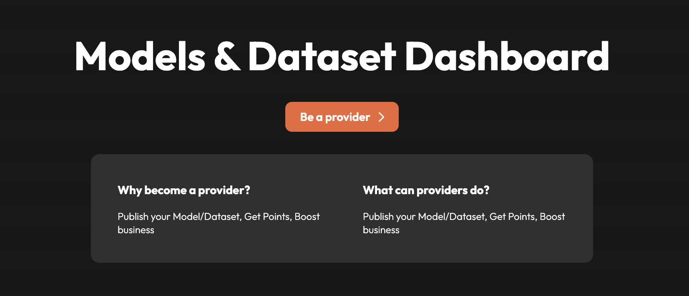

# Orange Proxy Providers
## 1. Background

TBA

## 2. Proxy Provider Introduction


Proxy wrapper helps to provide a unified interface for different providers,hiding api keys, embedding request data signature verification and decryption, response data signing and encryption .


## 3. How to be an Orange proxy provider
If you want to be an Orange proxy provider, you need to follow these steps:
1. Register the provider in Orange system.
   
2. Fill the provider information in Orange system.
   
   **Note**: the "Signing Address" is used to sign the response message and decrypt the response message as module provider.

3. The register information will be reviewed by Orange system, and if approved, the provider will be activated.

### 3.1 Orange proxy wrapper
1. Get Orange proxy wrapper project from [Github](https://github.com/orange-protocol/orange-provider-wrapper)
```
git clone https://github.com/orange-protocol/orange-provider-wrapper.git

cd orange-provider-wrapper 

go build
```

Generally, you don't need to modify the code of the proxy wrapper, but you can customize the provider information if you need to connect to the api which request format not supported by the provider wrapper .

2. Edit the config.json file

A sample config.json looks like below:
```json
{
    "orange_did":"did:etho:1ae43df6f4c5621e2b156162e958c80a67ee4f5f",
    "keystore":"./keystore",
    "wallet_pwd":"123456",
    "chain_id":5851,
    "chain_rpc":"http://polaris1.ont.io:20339",
    "contract_address":"0x18d3dB10B18369691c86e7EF99cBd9B290BaD87A",
    "api_configs":[
        {
            "provider_type":"dp",
            "verify_request":true,
            "server_path":"/balance1",
            "has_api_key":true,
            "api_key_location":"header",
            "api_key_name":"x-api-key",
            "api_key":"test",
            "api_url":"http://localhost:8088/sampleGetUrlDP",
            "api_method":"GET",
            "param_type":"url",
            "failed_keywords":[]
        },
        {
            "provider_type":"dp",
            "verify_request":false,
            "server_path":"/balance2",
            "has_api_key":true,
            "api_key_location":"header",
            "api_key_name":"x-api-key",
            "api_key":"test",
            "api_url":"http://localhost:8088/sampleGetBodyDP",
            "api_method":"POST",
            "param_type":"body",
            "failed_keywords":[]
        },{
            "provider_type":"ap",
            "verify_request":true,
            "server_path":"/score",
            "has_api_key":true,
            "api_key_location":"header",
            "api_key_name":"x-api-key",
            "api_key":"test",
            "api_url":"http://localhost:8088/sampleAP",
            "api_method":"POST",
            "param_type":"body",
            "failed_keywords":[]
        }
    ]
}
```

- orange_did: the DID of the provider in Orange system, will be published on Orange website.
- keystore: the keystore directory of the provider, which contains the private key of the provider.
- wallet_pwd: password for the wallet stored in the keystore directory.
- chain_id: the chain id of orange contract deployed.
- chain_rpc: chain rpc.
- contract_address: orange contract address.
The ```chain_id,chain_rpc and contract_address``` will also published on Orange website.
- api_configs: the api configuration of the provider.
- - provider_type: "ap" for module provider, "dp" for data provider.
- - verify_request: whether to verify the request message signature.
- - server_path: the server path of the wrapper service.
- - has_api_key: whether the api requires api key.
- - api_key_location: the location of the api key, supported values are "header" only for now. 
- - api_key_name: the name of the api key.
- - api_key: the value of the api key.
- - api_url: the api url.
- - api_method: the api method, "GET" or "POST".
- - param_type: the type of the api parameter, "url" or "body".
- - failed_keywords: the keywords of the response message which will cause the request to fail.

### 3.2 Create sign wallet and register did
1. Create wallet
run the following command in your terminal   
```
./orange-provider-wrapper --operation new-wallet

```
the standard etheraum wallet file will be generated in the keystore directory with the password you set in config.json.

2. Register did
run the following command in your terminal   
```
./orange-provider-wrapper --operation register-did

```
***NOTE***: You need transfer some gas to your wallet address you just created .

### 3.3 Proxy data provider
If you want to be a data provider, you just need to :
1. Get a data source api.
For example:
```
http://sampleDataSourceApi/sampleGetUrlDP?address=0x123456

```
with apikey :```x-api-key:test``` in request header

add "api_configs" section in config.json:
```
    {
        "provider_type":"dp",
        "verify_request":true,
        "server_path":"/balance1",
        "has_api_key":true,
        "api_key_location":"header",
        "api_key_name":"x-api-key",
        "api_key":"test",
        "api_url":"http://sampleDataSourceApi/sampleGetUrlDP",
        "api_method":"GET",
        "param_type":"url",
        "failed_keywords":[]
    }
```
The proxy wrapper will listen the GET /balance1 path and forward requests to data source api with api key 

2. Create dataset in Orange


input the dataset information


chose "GET" and input the wrapper url ```http://wrapper_address/balance1```


add param "address" with value "User Address"

this will acturally create a dataset with url ```http://sampleDataSourceApi/sampleGetUrlDP?address=$DEFAULT_USER_ADDRESS```

if you chose the "POST" method, you need to add the param "body" with the request body with 
```
{
    "address":"$DEFAULT_USER_ADDRESS"
}
```
Currently Orange supports
- User Address: the default address of logged in user.
- Twitter Handle: the Twitter handle of logged in user.(if binded)
- Discord ID: the Discord ID of logged in user.(if binded)

#### Parameter Schema & Output Schema
schema of the input parameter and output data, used for match dataset and module.(module's parameter schema should exactly match the dataset's output schema)

### 3.4 Proxy module provider
Simliar with the dataset